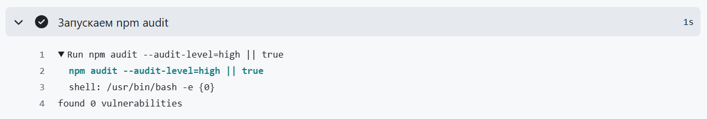
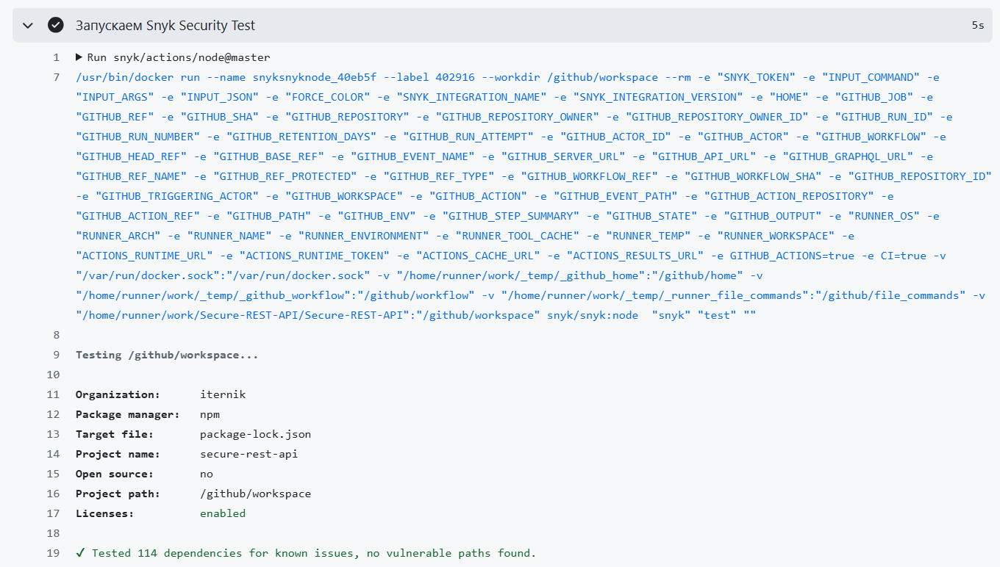

# Secure REST API

## Разработка защищенного REST API с интеграцией в CI/CD

**Назначение:** получить практический опыт разработки безопасного
backend-приложения с автоматизированной проверкой кода на уязвимости. Освоить
принципы защиты от OWASP Top 10 и интеграцию инструментов безопасности в процесс
разработки.

### Архитектура проекта

API реализовано с использованием Node.js + Express

**Модули:**

- `features` - основная единица функционала
  - `user-pofile` - работа с данными пользователя
  - `user-authentication` - работа с данными авторизации пользователя
- `middleware` - прослойки для валидации запросов и безопасности
- `utils` - общие утилиты
- `database` - прослойка для работы с БД
- `app` - основной сервер приложения
- `routes` - эндпоинты для обработки запросов

Для хранения данных используется PostgreSQL

**Методы:**

- `POST /api/v1/login` - для авторизации пользователя

```json
{
  "email": "string",
  "password": "string"
}
```

- `POST /api/v1/register` - для регистрации пользователя

```json
{
  "email": "string",
  "password": "string"
}
```

- `POST /api/v1/logout` - для выхода из сессии

Только вторизованным пользователям:

- `GET /api/v1/user` - получение списка всех пользователей
- `GET /api/v1/user/:id` - получение данных конкретного пользователя
- `PATCH /api/v1/user/:id` - изменение данных пользователя
- `DELETE /api/v1/user/:id` - удаление пользователя

Модель данных пользователя:

```prisma
model UserProfile {
  id             String   @id @default(cuid(2))
  email          String   @unique
  createdAt      DateTime @default(now())
  updatedAt      DateTime @updatedAt
  name           String   @default("")
  hashedPassword String
}
```

### Для запуска

1. Развернуть базу данных локально `docker-compose up`
2. Создать `.env` на основе `.env.example`
3. `npm run prisma:setup`
4. `npm run start`

### Базовые меры защиты

**Защита от SQL-инъекций**: для работы с БД используется ORM Prisma.
Доказательство безопасности модуля можно найти
[тут](https://www.prisma.io/docs/orm/prisma-client/using-raw-sql/raw-queries#sql-injection)

**Защита от XSS:** для валидации входных данных используется
[Zod](https://zod.dev/) +
[zod-xss-sanitizer](https://socket.dev/npm/package/zod-xss-sanitizer)

**Защита от Broken Authentication:**

- При авторизации / регистрации в куки выставляется `jwt` токен
- `Middleware` проверяет валидность токена из куки в каждом запросе
- Пароли хэшируются алгоритмом `bcrypt`

### Security сканнеры

Настроен [пайплайн](https://github.com/ITerNik/Secure-REST-API/actions/runs/17964559755/job/51094348268) анализа кода на уязвимости

**Static Application Testing**: `npm audit --audit-level=high`


**Software Composition Analysis**: `snyk test`


Отчеты генерирует Snyk и выгружает в [GitHub Security](https://github.com/ITerNik/Secure-REST-API/security/code-scanning/tools/Snyk%20Open%20Source/status)

Последний успешный пайплайн можно найти [тут](https://github.com/ITerNik/Secure-REST-API/actions/)